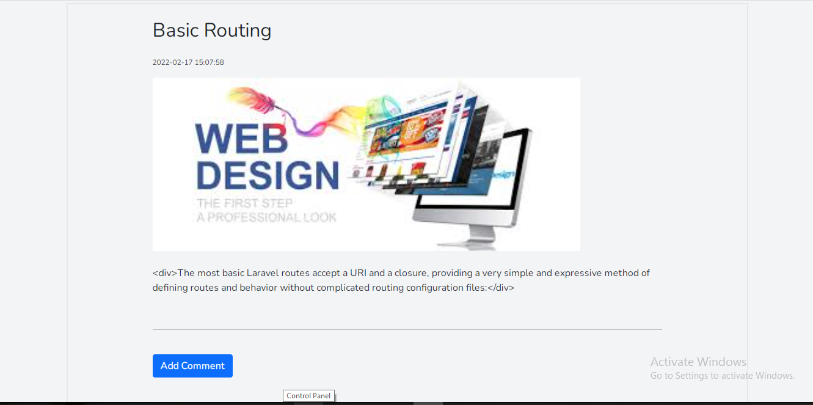

## Laravel cms
### Introduction:
Blog CMS is a simple blog CMS that allows you create blogs. Though, it doesn't compose of unneccessary features.

## preview:
### sample 1:

### sample 2:

### sample 3:
